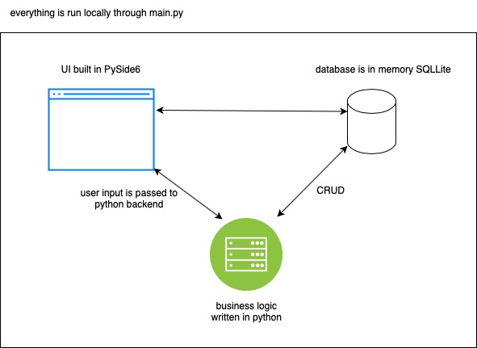
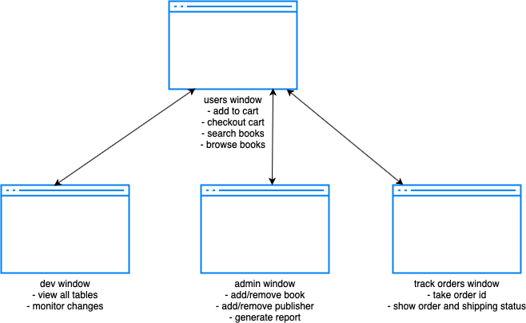
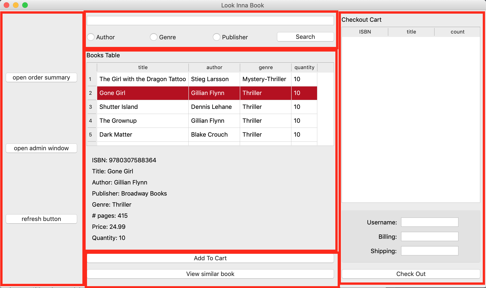
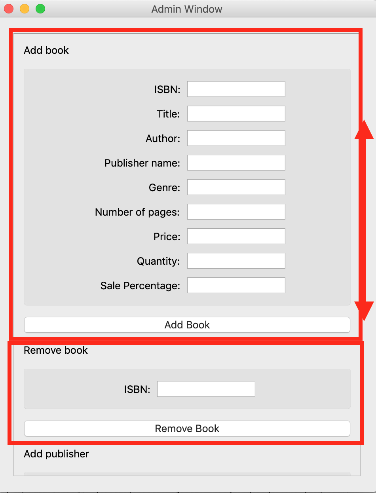
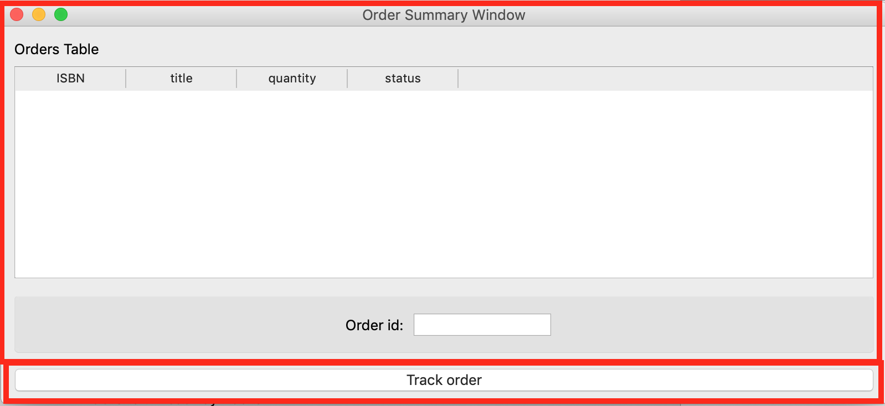

# 3005-bookstore

# project layout
`/SQL` - contains DDL and SQL queries\
`main.py` - entry point to program\
`requirement.txt` - list pip requirements\
`bookstore.py` - main window for this app\
`adminWindow.py` - admin window\
`devWindow.py` - developer window\
`order_summary.py` - track order window\
`backend_functions.py` - contain business logic\
`createdb.py` - initialise an SQLite in memory database with data

# How to use
- ensure you have the pip requirements and you are suggested to work in a virtual environment
- You can install the required dependencies by running `pip install -r requirement.txt`. pip expects relative path to requirement.txt
- run `python main.py`

# Product architecture

# Product workflow
## UI overview

## bookstore (users) window

- left panel connects admin window, refresh button, track order window
- central panel (top) has search bar with auto complete, and is able to search on custom type
- central panel (middle) has books currently in the database
- central panel (bottom) has view similar book, and add to cart
- right panel (top) has the current cart
- right panel (bottom) has user input areas and a checkout button

## admin window

- scrollable window where the admin can:
- add book
- remove book
- add  publisher
- remove publisher
- generate custom report based on monthly time range
- report types are: sales per genre, sales per author, sales per publisher

## track order window

- enter a order id to track it's shipping status and order information

# Sample scenarios
1. In the search bar, enter "the", to get auto complete results
1. In the search bar, enter "Stieg Larsson" and select the "author" radio button, to get a new window with search results
1. In the books table, scroll and select any book, its full information is displayed below
1. Add to cart button, select desired books and add to cart, and it appears on cart with count
1. View similar book, select a book from the books table and click view similar book to get a new window with similar books
1. Checkout button, after adding books, enter username as "gordontang" and anything for billing and shipping, then click refresh button on the bottom left to see the quantity of book decrease and a message with your order id (copy this id or use 9780804188975 if you forgot) or an error window pops up
1. From the left panel, click on the order summary button, and insert your copied id to see your recent purchase and its shipping status
1. From the left panel, click on the admin window button and enter a new book. Note that values have to be valid. Try ISBN=9781472134953, publisher=Knopf and valid strings/numbers for the other fields. A window should pop up saying its succuessful or not. Go back to the bookstore window and click the refresh button to see the new book added.
1.  From the left panel, click on the admin window button and remove a book by its ISBN
1.  From the left panel, click on the admin window button and add publisher and a new name. This is needed for foreign contraint checks.
1.  From the left panel, click on the admin window button and remove publisher by name.
1.  From the left panel, click on the admin window button and generate report. Enter a month range (our dummy data is in Nov/Dec), and a type of report. A new window with graphs should appear.

# Known bugs
- you must toggle admin/track window with the button, press x closes the window but you have to press twice to open the window again
